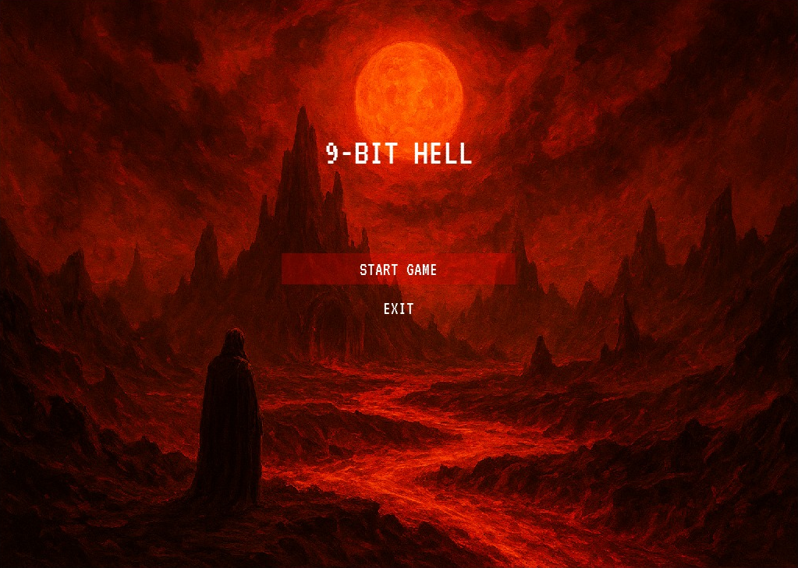
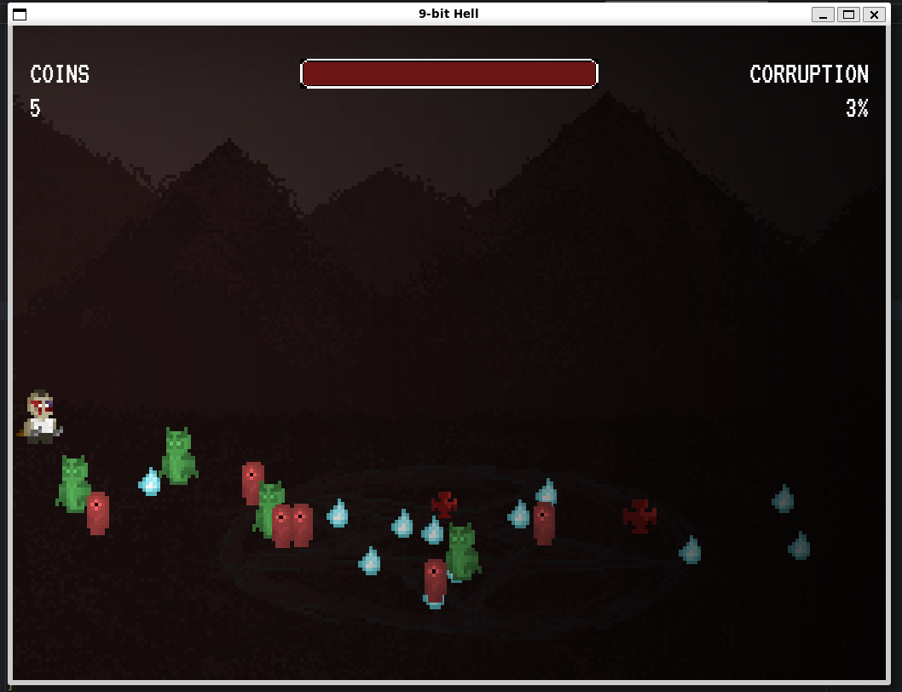
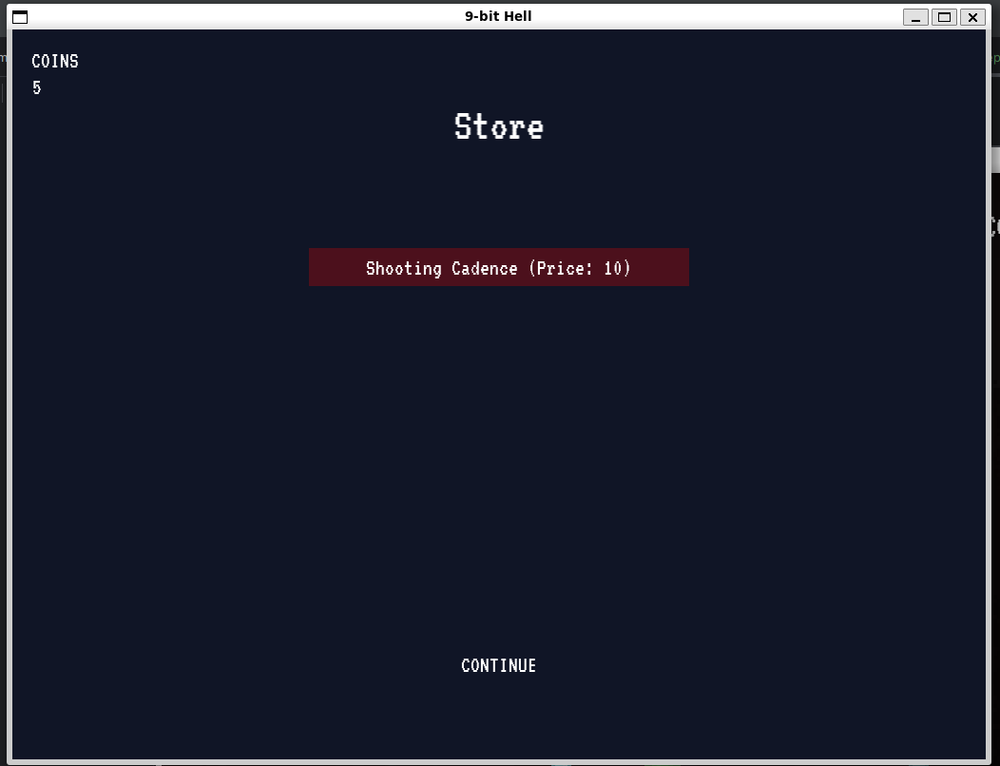
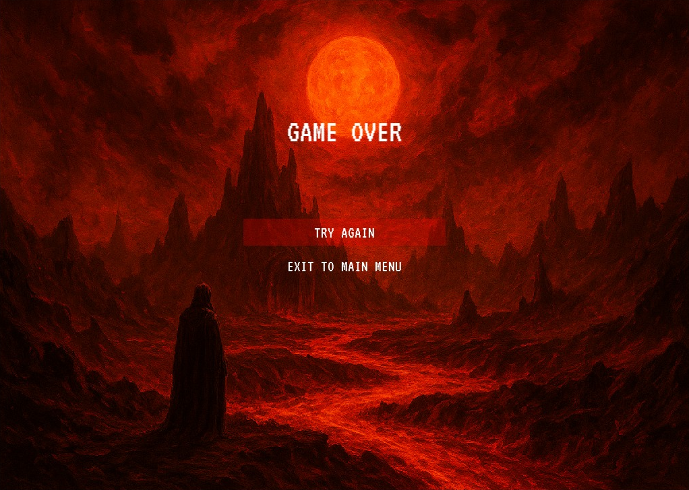

# 9-bit Hell

> 8 bits weren't enough for Hell.

## Screenshots

## Título

**9-bit Hell**

## Descrição

"9-bit Hell" é um jogo de ação *top-down shooter* em pixel art, inspirado nos nove círculos do Inferno de Dante Alighieri. 
O jogador controla uma alma perdida que busca redenção enfrentando criaturas sombrias enquanto avança por diferentes regiões do submundo.
A movimentação é feita pelas teclas **W, A, S, D**, enquanto os ataques são executados com **J** (corpo a corpo) e **K** (ataque à distância), 
oferecendo um estilo de combate rápido e responsivo.

O jogo apresenta a mecânica central de **Corrupção Progressiva**, onde a visão do jogador é gradualmente reduzida por uma vinheta escurecedora 
conforme o tempo passa na fase. Isso cria um ciclo de tensão crescente que exige decisões rápidas e precisas, 
incentivando o jogador a buscar itens de purificação para restaurar temporariamente a clareza visual. Navegar e sobreviver torna-se cada vez mais
difícil conforme inimigos se acumulam e o campo de visão se fecha.

A vitória depende da capacidade de avançar pelos círculos do Inferno enquanto administra a corrupção, derrota hordas de inimigos e coleta
moedas para melhorias futuras. A derrota ocorre ao perder toda a vida ou quando a corrupção torna o ambiente incontrolável.
Ao ser acertado, o personagem sofre um breve congelamento de 1 segundo, exibe animação de impacto e ganha 1.5 segundos de invencibilidade com
efeito de piscada.Tanto ataques corpo a corpo quanto projéteis causam um efeito de flash ao atingir inimigos, reforçando o feedback visual do combate.

## Funcionalidades a serem testadas

* Intensidade, progressão e impacto da mecânica de **Corrupção Progressiva**, especialmente no efeito de redução de visão.
* Equilíbrio entre ataques corpo a corpo (**J**) e ataques à distância (**K**), considerando dano, alcance e utilidade situacional.
* Precisão e responsividade da movimentação do jogador (**W, A, S, D**) em situações de combate e fuga.
* Comportamento, variedade e nível de dificuldade das hordas de inimigos durante a partida.
* Clareza do feedback ao coletar **itens de purificação** e **moedas**, e seu impacto imediato no fluxo de jogo.
* Funcionamento consistente da renderização **2.5D** baseada na posição Y, garantindo a ordem correta entre personagens e objetos.
* Compreensão e impacto do **sistema de upgrades** adquiridos com moedas, incluindo feedback visual e sensação de progressão.

## Créditos

**Gabriel Vieira Pereira da Silva** – 2020105777

**Guilherme Mota Bromonschenkel Lima** – 2019027571

**Pedro Medina Lara Silva** – 2022423431
